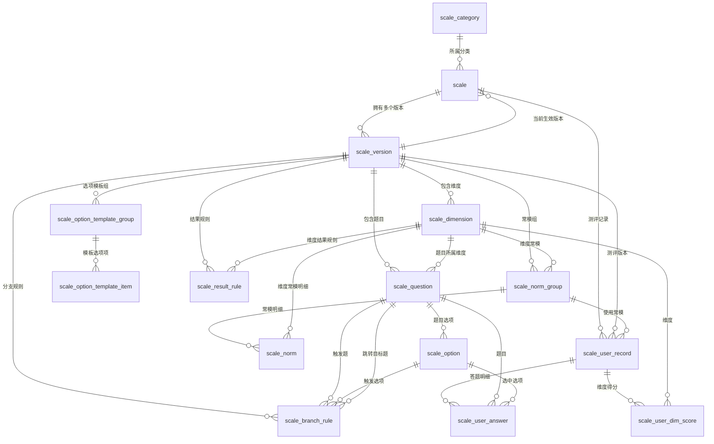

## 量表测评相关

### 量表类别表

```sql
CREATE TABLE IF NOT EXISTS `scale_category` (
                                                `id` bigint NOT NULL PRIMARY KEY AUTO_INCREMENT COMMENT '自增主键ID',
                                                `category_name` varchar(100) NOT NULL COMMENT '类别名称',
                                                `sort` int DEFAULT 0 COMMENT '排序',

                                                `created_time` datetime DEFAULT CURRENT_TIMESTAMP COMMENT '创建时间',
                                                `created_by` bigint DEFAULT NULL COMMENT '创建人用户ID',
                                                `updated_time` datetime DEFAULT CURRENT_TIMESTAMP ON UPDATE CURRENT_TIMESTAMP COMMENT '最后更新时间',
                                                `updated_by` bigint DEFAULT NULL COMMENT '最后更新人用户ID',
                                                `deleted` tinyint NOT NULL DEFAULT 0 COMMENT '是否删除，0-否，1-是'
) ENGINE=InnoDB DEFAULT CHARSET=utf8mb4 COLLATE=utf8mb4_unicode_ci COMMENT='量表类别表';
```

### 量表主表

```sql
CREATE TABLE IF NOT EXISTS `scale` (
    `id` bigint NOT NULL PRIMARY KEY AUTO_INCREMENT COMMENT '自增主键ID（一个量表多个版本共用这个id）',
    `scale_category_id` bigint DEFAULT NULL COMMENT '分类ID',
    `current_version_id` bigint DEFAULT NULL COMMENT '当前生效的版本ID，关联scale_version.id',
    `scale_name` varchar(100) NOT NULL COMMENT '量表名称',
    `status` tinyint NOT NULL DEFAULT 1 COMMENT '状态：0=禁用 1=启用',
    `allow_repeat` tinyint DEFAULT 1 COMMENT '是否允许重复作答',
    `cool_minutes` int DEFAULT 0 COMMENT '重复作答冷却时间(分钟)',
    `time_limit` int DEFAULT NULL COMMENT '作答限时，单位秒，NULL不限时',
    `anonymous` tinyint DEFAULT 0 COMMENT '是否匿名测评',
    
    `created_time` datetime DEFAULT CURRENT_TIMESTAMP COMMENT '创建时间',
    `created_by` bigint DEFAULT NULL COMMENT '创建人用户ID',
    `updated_time` datetime DEFAULT CURRENT_TIMESTAMP ON UPDATE CURRENT_TIMESTAMP COMMENT '最后更新时间',
    `updated_by` bigint DEFAULT NULL COMMENT '最后更新人用户ID',
    `deleted` tinyint NOT NULL DEFAULT 0 COMMENT '是否删除，0-否，1-是'
) ENGINE=InnoDB DEFAULT CHARSET=utf8mb4 COLLATE=utf8mb4_unicode_ci COMMENT='量表主表';
```

### 量表版本表

```sql
CREATE TABLE IF NOT EXISTS `scale_version` (
    `id` bigint NOT NULL PRIMARY KEY AUTO_INCREMENT COMMENT '量表版本ID，测评记录绑定这个',
    `scale_id` bigint NOT NULL COMMENT '量表基础ID',
    `description` varchar(1000) DEFAULT NULL COMMENT '量表说明、指导语、开头介绍',
    `copyright_info` varchar(500) DEFAULT NULL COMMENT '量表版权/授权说明（合规用）',
    `version_no` varchar(32) NOT NULL COMMENT '版本号 v1.0',

    `created_time` datetime DEFAULT CURRENT_TIMESTAMP COMMENT '创建时间',
    `created_by` bigint DEFAULT NULL COMMENT '创建人用户ID',
    `updated_time` datetime DEFAULT CURRENT_TIMESTAMP ON UPDATE CURRENT_TIMESTAMP COMMENT '最后更新时间',
    `updated_by` bigint DEFAULT NULL COMMENT '最后更新人用户ID',
    `deleted` tinyint NOT NULL DEFAULT 0 COMMENT '是否删除，0-否，1-是',

    UNIQUE KEY uk_scale_version (`scale_id`, `version_no`),
    INDEX idx_scale_id (`scale_id`)
) ENGINE=InnoDB DEFAULT CHARSET=utf8mb4 COLLATE=utf8mb4_unicode_ci COMMENT='量表版本表';
```

### 量表维度

```sql
CREATE TABLE IF NOT EXISTS `scale_dimension` (
    `id` bigint NOT NULL PRIMARY KEY AUTO_INCREMENT,
    `scale_version_id` bigint NOT NULL COMMENT '量表版本ID',
    `dim_name` varchar(100) NOT NULL COMMENT '维度名称：抑郁、焦虑',
    `dim_code` varchar(50) NOT NULL COMMENT '维度编码，用于程序计算',
    `dim_desc` varchar(500) DEFAULT NULL COMMENT '维度说明',
    `sort` int DEFAULT 0 COMMENT '排序',

    `created_time` datetime DEFAULT CURRENT_TIMESTAMP COMMENT '创建时间',
    `created_by` bigint DEFAULT NULL COMMENT '创建人用户ID',
    `updated_time` datetime DEFAULT CURRENT_TIMESTAMP ON UPDATE CURRENT_TIMESTAMP COMMENT '最后更新时间',
    `updated_by` bigint DEFAULT NULL COMMENT '最后更新人用户ID',
    `deleted` tinyint NOT NULL DEFAULT 0 COMMENT '是否删除，0-否，1-是',

    INDEX idx_version_id (`scale_version_id`)
) ENGINE=InnoDB DEFAULT CHARSET=utf8mb4 COLLATE=utf8mb4_unicode_ci COMMENT='量表维度/因子表';
```

### 量表题目表

```sql
CREATE TABLE IF NOT EXISTS `scale_question` (
    `id` bigint NOT NULL PRIMARY KEY AUTO_INCREMENT COMMENT '自增主键ID',
    `scale_version_id` bigint NOT NULL COMMENT '量表版本ID',
    `dimension_id` bigint DEFAULT NULL COMMENT '所属维度ID，筛选题可以为空',
    `title` varchar(500) NOT NULL COMMENT '题干',
    `question_type` tinyint NOT NULL DEFAULT 1 COMMENT '1单选 2多选 3填空',
    `sort` int DEFAULT 0 COMMENT '题目顺序',
    `score_type` tinyint DEFAULT 1 COMMENT '1正向计分 2反向计分 0不计分',
    `required` tinyint DEFAULT 1 COMMENT '是否必答',
    
    `created_time` datetime DEFAULT CURRENT_TIMESTAMP COMMENT '创建时间',
    `created_by` bigint DEFAULT NULL COMMENT '创建人用户ID',
    `updated_time` datetime DEFAULT CURRENT_TIMESTAMP ON UPDATE CURRENT_TIMESTAMP COMMENT '最后更新时间',
    `updated_by` bigint DEFAULT NULL COMMENT '最后更新人用户ID',
    `deleted` tinyint NOT NULL DEFAULT 0 COMMENT '是否删除，0-否，1-是',
    
    INDEX `idx_scale_version_id` (`scale_version_id`)
) ENGINE=InnoDB DEFAULT CHARSET=utf8mb4 COLLATE=utf8mb4_unicode_ci COMMENT='量表题目表';
```

### 题目选项表

```sql
CREATE TABLE IF NOT EXISTS `scale_option` (
    `id` bigint NOT NULL PRIMARY KEY AUTO_INCREMENT COMMENT '自增主键ID',
    `question_id` bigint NOT NULL COMMENT '所属题目ID',
    `option_text` varchar(200) NOT NULL COMMENT '选项描述',
    `score` decimal(5,2) DEFAULT NULL COMMENT '该选项对应的原始分数',
    `sort` int DEFAULT 0 COMMENT '选项显示顺序',
    
    `created_time` datetime DEFAULT CURRENT_TIMESTAMP COMMENT '创建时间',
    `created_by` bigint DEFAULT NULL COMMENT '创建人用户ID',
    `updated_time` datetime DEFAULT CURRENT_TIMESTAMP ON UPDATE CURRENT_TIMESTAMP COMMENT '最后更新时间',
    `updated_by` bigint DEFAULT NULL COMMENT '最后更新人用户ID',
    `deleted` tinyint NOT NULL DEFAULT 0 COMMENT '是否删除，0-否，1-是',
    
    INDEX `idx_question_id` (`question_id`)
) ENGINE=InnoDB DEFAULT CHARSET=utf8mb4 COLLATE=utf8mb4_unicode_ci COMMENT='题目选项表';
```

### 选项模板组表

```sql
CREATE TABLE IF NOT EXISTS `scale_option_template_group` (
    `id` bigint NOT NULL PRIMARY KEY AUTO_INCREMENT COMMENT '自增主键ID',
    `scale_version_id` bigint NOT NULL COMMENT '量表版本ID',
    `template_name` varchar(100) NOT NULL COMMENT '模板名称',
    `template_desc` varchar(200) DEFAULT NULL COMMENT '模板描述',
    
    `created_time` datetime DEFAULT CURRENT_TIMESTAMP COMMENT '创建时间',
    `created_by` bigint DEFAULT NULL COMMENT '创建人用户ID',
    `updated_time` datetime DEFAULT CURRENT_TIMESTAMP ON UPDATE CURRENT_TIMESTAMP COMMENT '最后更新时间',
    `updated_by` bigint DEFAULT NULL COMMENT '最后更新人用户ID',
    `deleted` tinyint NOT NULL DEFAULT 0 COMMENT '是否删除，0-否，1-是',
    
    INDEX `idx_scale_version_id` (`scale_version_id`)
) ENGINE=InnoDB DEFAULT CHARSET=utf8mb4 COLLATE=utf8mb4_unicode_ci COMMENT='题目选项模板表';
```

### 选项模板表

```sql
CREATE TABLE IF NOT EXISTS `scale_option_template_item` (
    `id` bigint NOT NULL PRIMARY KEY AUTO_INCREMENT COMMENT '自增主键ID',
    `template_group_id` bigint NOT NULL COMMENT '模板组ID',
    `option_text` varchar(200) NOT NULL COMMENT '选项描述',
    `score` decimal(5,2) DEFAULT NULL COMMENT '该选项对应的原始分数',
    `sort` int DEFAULT 0 COMMENT '选项显示顺序',
    
    `created_time` datetime DEFAULT CURRENT_TIMESTAMP COMMENT '创建时间',
    `created_by` bigint DEFAULT NULL COMMENT '创建人用户ID',
    `updated_time` datetime DEFAULT CURRENT_TIMESTAMP ON UPDATE CURRENT_TIMESTAMP COMMENT '最后更新时间',
    `updated_by` bigint DEFAULT NULL COMMENT '最后更新人用户ID',
    `deleted` tinyint NOT NULL DEFAULT 0 COMMENT '是否删除，0-否，1-是',
    
    INDEX `idx_template_group_id` (`template_group_id`)
) ENGINE=InnoDB DEFAULT CHARSET=utf8mb4 COLLATE=utf8mb4_unicode_ci COMMENT='题目选项模板表';
```

### 跳题分支规则表

```sql
CREATE TABLE IF NOT EXISTS `scale_branch_rule` (
    `id` bigint NOT NULL PRIMARY KEY AUTO_INCREMENT,
    `scale_version_id` bigint NOT NULL COMMENT '量表版本ID',
    `source_question_id` bigint NOT NULL COMMENT '触发题',
    `source_option_id` bigint DEFAULT NULL COMMENT '选中该选项触发',
    `target_question_id` bigint DEFAULT NULL COMMENT '跳转到哪一题，NULL结束测评',

    `created_time` datetime DEFAULT CURRENT_TIMESTAMP COMMENT '创建时间',
    `created_by` bigint DEFAULT NULL COMMENT '创建人用户ID',
    `updated_time` datetime DEFAULT CURRENT_TIMESTAMP ON UPDATE CURRENT_TIMESTAMP COMMENT '最后更新时间',
    `updated_by` bigint DEFAULT NULL COMMENT '最后更新人用户ID',
    `deleted` tinyint NOT NULL DEFAULT 0 COMMENT '是否删除，0-否，1-是',
    
  INDEX `idx_version_id` (`scale_version_id`)
) ENGINE=InnoDB DEFAULT CHARSET=utf8mb4 COLLATE=utf8mb4_unicode_ci COMMENT='量表跳题分支规则';
```

### 量表结果规则表

```sql
CREATE TABLE IF NOT EXISTS `scale_result_rule` (
    `id` bigint NOT NULL PRIMARY KEY AUTO_INCREMENT COMMENT '自增主键ID',
    `scale_version_id` bigint NOT NULL COMMENT '量表版本ID',
    `dimension_id` bigint DEFAULT NULL COMMENT '维度ID，NULL代表总分规则',
    `min_score` decimal(5,2) DEFAULT 0 COMMENT '区间最低分（包含）',
    `max_score` decimal(5,2) DEFAULT 0 COMMENT '区间最高分（包含）',
    `result_text` varchar(500) DEFAULT NULL COMMENT '测评结果描述文本',
    `risk_level` tinyint DEFAULT 0 COMMENT '0无风险 1低 2中 3高（预警）',
    `sort` int DEFAULT NULL COMMENT '排序序号',
    
    `created_time` datetime DEFAULT CURRENT_TIMESTAMP COMMENT '创建时间',
    `created_by` bigint DEFAULT NULL COMMENT '创建人用户ID',
    `updated_time` datetime DEFAULT CURRENT_TIMESTAMP ON UPDATE CURRENT_TIMESTAMP COMMENT '最后更新时间',
    `updated_by` bigint DEFAULT NULL COMMENT '最后更新人用户ID',
    `deleted` tinyint NOT NULL DEFAULT 0 COMMENT '是否删除，0-否，1-是',
    
    INDEX `idx_scale_version_id` (`scale_version_id`)
) ENGINE=InnoDB DEFAULT CHARSET=utf8mb4 COLLATE=utf8mb4_unicode_ci COMMENT='量表结果规则表';
```

### 常模组定义表

```sql
CREATE TABLE IF NOT EXISTS `scale_norm_group` (
    `id` bigint NOT NULL PRIMARY KEY AUTO_INCREMENT COMMENT '常模组ID',
    `scale_version_id` bigint NOT NULL COMMENT '量表版本ID',
    `dimension_id` bigint DEFAULT NULL COMMENT '维度ID，NULL代表总分常模',

    -- 常模组标识
    `group_name` varchar(100) NOT NULL COMMENT '常模组名称，如"全国成年男性常模"',
    `group_code` varchar(50) DEFAULT NULL COMMENT '常模组编码，方便程序查找',

    -- 人口学筛选条件（NULL = 不限）
    `gender` tinyint DEFAULT NULL COMMENT '性别：1=男 2=女 NULL=不限',
    `age_min` int DEFAULT NULL COMMENT '最小年龄（包含）',
    `age_max` int DEFAULT NULL COMMENT '最大年龄（包含）',
    `education` tinyint DEFAULT 0 COMMENT '学历：1=初中, 2=高中, 3=大专, 4=本科, 5=硕士, 6=博士 0=不限',
    `occupation` tinyint DEFAULT 0 COMMENT '职业群体：学生/医护/军人/企业员工 0=不限',
    `region` tinyint DEFAULT 0 COMMENT '地区：华北/华东/华南/西南 0=不限',

    -- 常模统计属性
    `norm_type` tinyint NOT NULL DEFAULT 0 COMMENT '常模计算方式：0=公式法(T=50+10*(X-M)/SD) 1=查表法，应用层检查数据完整性',
    `mean` decimal(8,4) DEFAULT NULL COMMENT '原始分均值 M',
    `sd` decimal(8,4) DEFAULT NULL COMMENT '原始分标准差 SD',

    -- 元数据
    `source` varchar(200) DEFAULT NULL COMMENT '常模来源/参考文献',
    `norm_year` int DEFAULT NULL COMMENT '常模制定年份',
    `sort` int DEFAULT 0 COMMENT '排序：默认常模排在最前',

    `created_time` datetime DEFAULT CURRENT_TIMESTAMP COMMENT '创建时间',
    `created_by` bigint DEFAULT NULL COMMENT '创建人用户ID',
    `updated_time` datetime DEFAULT CURRENT_TIMESTAMP ON UPDATE CURRENT_TIMESTAMP COMMENT '最后更新时间',
    `updated_by` bigint DEFAULT NULL COMMENT '最后更新人用户ID',
    `deleted` tinyint NOT NULL DEFAULT 0 COMMENT '是否删除，0=否 1=是',

    INDEX `idx_version_dim` (`scale_version_id`, `dimension_id`)
) ENGINE=InnoDB DEFAULT CHARSET=utf8mb4 COLLATE=utf8mb4_unicode_ci COMMENT='常模组定义表';
```

###  常模转换明细表

```sql
CREATE TABLE IF NOT EXISTS `scale_norm` (
    `id` bigint NOT NULL PRIMARY KEY AUTO_INCREMENT COMMENT '自增主键ID',
    `norm_group_id` bigint NOT NULL COMMENT '常模组ID，关联 scale_norm_group',
    `dimension_id` bigint DEFAULT NULL COMMENT '维度ID（冗余，方便直接查询），NULL=总分',

    -- 原始分
    `raw_score` decimal(6,2) NOT NULL COMMENT '原始分',

    -- 标准分（可多选，全部可NULL，按需填充）
    `t_score` decimal(6,2) DEFAULT NULL COMMENT 'T分：均值50 标准差10',
    `z_score` decimal(6,2) DEFAULT NULL COMMENT 'Z分：均值0  标准差1',
    `percentile` decimal(5,2) DEFAULT NULL COMMENT '百分等级 0.00~100.00',
    `stanine` tinyint DEFAULT NULL COMMENT '标准九 1~9',
    `diq` decimal(6,2) DEFAULT NULL COMMENT '离差智商：均值100 标准差15',

    -- 定性标签（可选）
    `level_label` tinyint DEFAULT NULL COMMENT '等级标签：0-极低/1-偏低/2-正常/3-偏高/4-极高',

    `created_time` datetime DEFAULT CURRENT_TIMESTAMP COMMENT '创建时间',
    `created_by` bigint DEFAULT NULL COMMENT '创建人用户ID',
    `updated_time` datetime DEFAULT CURRENT_TIMESTAMP ON UPDATE CURRENT_TIMESTAMP COMMENT '最后更新时间',
    `updated_by` bigint DEFAULT NULL COMMENT '最后更新人用户ID',
    `deleted` tinyint NOT NULL DEFAULT 0 COMMENT '是否删除，0=否 1=是',

    UNIQUE KEY `uk_group_dim_raw` (`norm_group_id`, `dimension_id`, `raw_score`),
    INDEX `idx_norm_group_id` (`norm_group_id`)
) ENGINE=InnoDB DEFAULT CHARSET=utf8mb4 COLLATE=utf8mb4_unicode_ci COMMENT='常模转换明细表';
```

### 用户测评记录表

```sql
CREATE TABLE IF NOT EXISTS `scale_user_record` (
    `id` bigint NOT NULL PRIMARY KEY AUTO_INCREMENT COMMENT '自增主键ID',
    `user_id` bigint NOT NULL COMMENT '用户ID',
    `scale_id` bigint NOT NULL COMMENT '量表主表ID',
    `scale_version_id` bigint NOT NULL COMMENT '量表版本ID',
    `norm_group_id` bigint DEFAULT NULL COMMENT '本次测评使用的常模组ID',
    `scale_name` varchar(100) DEFAULT NULL COMMENT '量表名称',
    `total_score` decimal(5,2) DEFAULT NULL COMMENT '最终计算原始总分',
    `standard_score` decimal(6,2) DEFAULT NULL COMMENT '标准分（如T分），由常模转换得出',
    `percentile` decimal(5,2) DEFAULT NULL COMMENT '百分等级快照',
    `result_text` varchar(500) DEFAULT NULL COMMENT '本次测评结果描述',
    `risk_level` tinyint DEFAULT 0 COMMENT '0无风险 1低 2中 3高（预警）',
    `finish_status` tinyint NOT NULL DEFAULT 0 COMMENT '0未完成 1已完成 2中途终止',
    `start_time` datetime DEFAULT CURRENT_TIMESTAMP COMMENT '开始作答时间',
    `end_time` datetime DEFAULT NULL COMMENT '提交时间',
    
    `created_time` datetime DEFAULT CURRENT_TIMESTAMP COMMENT '创建时间',
    `deleted` tinyint NOT NULL DEFAULT 0 COMMENT '是否删除，0-否，1-是',
    
    INDEX `idx_user_id` (`user_id`),
    INDEX `idx_scale_id` (`scale_id`)
) ENGINE=InnoDB DEFAULT CHARSET=utf8mb4 COLLATE=utf8mb4_unicode_ci COMMENT='用户测评记录表';
```

### 用户答题明细表

```sql
CREATE TABLE IF NOT EXISTS `scale_user_answer` (
    `id` bigint NOT NULL PRIMARY KEY AUTO_INCREMENT COMMENT '自增主键ID',
    `record_id` bigint NOT NULL COMMENT '关联的测评记录ID',
    `question_id` bigint NOT NULL COMMENT '题目ID',    
    `option_id` bigint DEFAULT NULL COMMENT '选中选项ID（单选/多选时使用，填空题为NULL）',
    `answer_text` varchar(1000) DEFAULT NULL COMMENT '填空/简答答案文本（question_type=3时使用，选择题为NULL）',
    `answer_status` tinyint NOT NULL DEFAULT 0 COMMENT '0未作答 1已选',
    `question_title` varchar(500) DEFAULT NULL COMMENT '题干快照',
    `option_text` varchar(200) DEFAULT NULL COMMENT '选项快照',
    `original_score` decimal(5,2) DEFAULT NULL COMMENT '该选项得分快照',
    `spend_seconds` int DEFAULT NULL COMMENT '本题耗时，秒',
    
    `created_time` datetime DEFAULT CURRENT_TIMESTAMP COMMENT '创建时间',
    `deleted` tinyint NOT NULL DEFAULT 0 COMMENT '是否删除，0-否，1-是',
    
    INDEX `idx_record_id` (`record_id`)
) ENGINE=InnoDB DEFAULT CHARSET=utf8mb4 COLLATE=utf8mb4_unicode_ci COMMENT='用户答题明细表';
```

### 用户维度得分快照表

```sql
CREATE TABLE IF NOT EXISTS `scale_user_dim_score` (
    `id` bigint NOT NULL PRIMARY KEY AUTO_INCREMENT COMMENT '自增主键ID',
    `record_id` bigint NOT NULL COMMENT '测评记录ID',
    `dimension_id` bigint NOT NULL COMMENT '维度ID',
    `dim_score` decimal(6,2) NOT NULL COMMENT '维度得分快照',
    `dim_result` varchar(500) DEFAULT NULL COMMENT '维度解读快照',
    `risk_level` tinyint DEFAULT 0,

    `created_time` datetime DEFAULT CURRENT_TIMESTAMP COMMENT '创建时间',
    `deleted` tinyint NOT NULL DEFAULT 0 COMMENT '是否删除，0-否，1-是',
    
  INDEX idx_record_id (`record_id`)
) ENGINE=InnoDB DEFAULT CHARSET=utf8mb4 COLLATE=utf8mb4_unicode_ci COMMENT='用户测评各维度得分';
```


## 表关系图（Mermaid ER）

